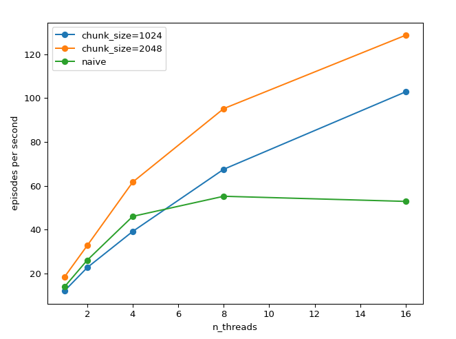

# jungle_gym
A C++ implementation of reinforcement learning algorithms using libtorch.

🚧 This repository is currently under development 🚧 

## Environments

### SnakeEnv

Emulates the snake game with a NN-friendly observation space.

#### Observation space:
Fully observable with each position containing $c$ channels, i.e. a tensor
of shape `[x,y,c]` where `x` and `y` correspond to width/height and $c$ is a channel encoding as follows:
- $c_0$ snake body
- $c_1$ snake head
- $c_2$ food
- $c_3$ wall

#### Rewards:

- REWARD_COLLISION = -1
- REWARD_APPLE = 5
- REWARD_MOVE = -0.05

#### Action space:

- LEFT = 0
- STRAIGHT = 1
- RIGHT = 2

## Policies

### 1. Vanilla Policy Gradient [^1]

This method is the basis for a large family of modern RL algorithms which operate by directly maximizing the expected 
reward or value of the actions taken by a policy.

#### Action sampling
$$
a_t =
\begin{cases}
\text{random action}, & \text{with probability } \epsilon \\
\arg\max_a \pi_\theta(a | s_t), & \text{with probability } 1 - \epsilon
\end{cases}
$$

#### Reward
$$ R_t = r_t + \gamma R_{t+1}$$

#### Loss

$$
L_\tau = -\sum_{t=0}^{T-1} \log p(a_t^*) \cdot R_t
$$

where $a_t^*$ is the action corresponding to the maximum probability in $\pi_\theta(a | s_t)$, or the action sampled
randomly in the case of epsilon greedy policies.

#### Epsilon annealing

$$
\epsilon_t = 0.99^{\frac{cn}{N}}
$$

- $n$ is the current episode index.
- $N$ is the total number episodes. 

The decay terminates when $\epsilon \approx 0.01$ by computing $c = \log_{0.99}(0.01) = 458.211$, for example

### 2. Policy Gradient with entropy regularization [^5]

Because models often converge on shallow maxima, their subsequent rollouts can become limited in exploration. Entropy 
regularization adds a reward for random behavior which is intended to attenuate against a feedback loop between 
action sampling (generating the training data) and bias in the policy. 

In practice, the entropy term is balanced against the reward term to avoid early collapse, and allow high reward 
rollouts to dwarf the entropy reward. In this sense, the entropy regularizer is a convenient and adaptive method to 
preventing early convergence, compared to epsilon scheduling, which is typically hardcoded.

$$
L_{total} = - \sum_{t=0}^{T-1} \left( \log \pi_\theta(a_t | s_t) \cdot R_t - \lambda H(\pi_\theta(a_t | s_t)) \right)
$$

where $R_t$ is computed according to Temporal Difference recurrence relation:

$$
R_t = r_t + \gamma R_{t+1}
$$

and $H(\mathcal{X})$ is the entropy of the action distribution at time $t$:

$$
H(\mathcal{X}) = - \sum_{x \in \mathcal{X}} p(x) \log p(x)
$$

Entropy is maximized when the action distribution emitted by the policy $\pi_\theta(a_t|s_t)$ is uniform, and minimized 
when any value tends toward 1. Entropy regularization therefore rewards exploration.

### 3. Actor-critic Policy Gradient with entropy regularization (A2C or AAC)

This method employs a second network that approximates the value function for a given state. During training, the actor
attempts to maximize the *advantage*, which captures how much better a particular action is than the expected value 
predicted by the critic. Subtracting this baseline reduces the variance of the policy gradient and provides more stable 
updates, even when the absolute scale of the rewards varies widely. While the critic loss remains sensitive to raw 
reward magnitude, the advantage-based policy (actor) update is relatively well-behaved.

$$
L_{actor} = - \sum_{t=0}^{T-1} \left( \log \pi_\theta(a_t | s_t) \cdot [R_t - V(s_t)] - \lambda H(\pi_\theta(a_t | s_t)) \right)
$$

$$
L_{critic} = \frac{1}{2} \sum_{t=0}^{T-1} \left(R_t - V(s_t)\right)^2
$$

### 4. Asynchronous Actor-Critic Agent (A3C) [^3]

This implementation of A3C makes use of a specialized, thread safe, parameter optimizer, RMSPropAsync, which 
combines gradients from worker threads to update a shared parameter set. The shared parameter set is then distributed 
back to the workers. It is not lock-free as the original A3C paper claims to be, but it offers a reasonably low 
contention alternative for which each module in the neural network has a separate mutex associated with it. The A3CAgent
class initializes a thread pool of A2CAgents which have a synchronization lambda function, for simplicity and modularity.


<p align="center">
  
</p>

RMSPropAsync takes the same form as standard non-centered RMSProp, with some changes to make it compatible with 
multiple workers. The gradients computed by the workers are returned to RMSPropAsync, which then updates its internal 
state, tracking the exponential moving average (EMA) of the squared gradient.

$$
\theta \gets \theta - \eta \frac{g_w}{\sqrt{G + \epsilon}}
$$

$$
G \gets \alpha G + (1 - \alpha) g_w^2
$$

- $\theta$ : The shared model parameter being updated.
- $\eta$ : The learning rate.
- $g_w$ : The gradient of the loss with respect to $\theta$ from worker $w$.
- $G$ : The exponentially weighted moving average of squared gradients (RMSProp accumulator).
- $\alpha$ : The decay factor for the moving average.
- $\epsilon$ : A small constant added for numerical stability.

The scaling behavior of RMSPropAsync is as follows:

<p align="center">
  
</p>

Where "naive" refers to the simple linear iteration of the vector<Tensor> of parameters, and the others use finer 
grained, uniform chunk sizes, and random iteration order. Episode lengths ($\tau$) are 16 steps. More information about 
benchmarking available [here](docs/a3c_benchmark.md). 


### 4. Proximal Policy Optimization (PPO)

PPO's approach to increasing sample efficiency is to perform trajectory sampling in large chunks and 
then batched training on those trajectories. This method is convenient for deployment because the trajectory sampling 
can be performed entirely without gradient tracking (inference only), and then localized for high efficiency training.

The focus of their publication is a loss term which acts as a surrogate for a KL divergence penalty, referred to as 
$L_{CLIP}$. The surrogate objective prevents updates from causing the parameters of the new policy from diverging
excessively from those of the previous policy, reducing the issues that come from nonstationarity and variance in
the reward.


$$
L_{CLIP} = \hat{\mathbb{E}}_t [ min(r_t\hat{A_t}, clip(r_t, 1 - \epsilon, 1 + \epsilon)\hat{A_t}) ]
$$

where 

$$
r_t = \frac{\pi_{\theta}(s_t,a_t)}{\pi_{\theta_{old}}(s_t,a_t)}
$$

And $\hat{A}$ is the advantage estimate, which is computed over the batches of length $T$ using Generalized Advantage 
Estimation (GAE):

$$
\hat{A} = \delta_t + (\gamma\lambda)\delta_{t+1} + ... + (\gamma\lambda)^{T-t+1}\delta_{T-1}
$$

where

$$
\delta_t = \underbrace{r_t + \gamma V(s_{t+1})}_{\text{Target}} - \underbrace{V(s_t)}_{\text{Current estimate}}
$$

Taken by itself, $\delta_t$ can be referred to as the "TD error", though in the context of trying to compute the 
advantage, "error" can be interpreted as the added (surprise) empirical benefit over the expected return from taking action 
$a_t$ at $s_t$.

The $L_{CLIP}$ term of the loss is combined with the usual critic MSE loss for each batch:

$$
L_{actor} = -L_{CLIP} - c_2L_{entropy}
$$

$$
L_{\text{critic}} = c_1 \sum_{t=0}^{T-1} \left(R_t - V(s_t)\right)^2
$$

(Signs are flipped relative to the publication to make it clear that the L stands for Loss which should be minimized)

## Models

### **ShallowNet**

| **Layer**       | **Dimensions**   |
|-----------------|------------------|
| **input**       | `w*h*4`          |
| **fc**          | 256              |
| **layernorm**   | -                |
| **GELU**        | -                |
| **fc**          | 256              |
| **layernorm**   | -                |
| **GELU**        | -                |
| **fc**          | 256              |
| **layernorm**   | -                |
| **GELU**        | -                |
| **fc**          | `output_size`    |
| **log_softmax** | `output_size`    |


### **SimpleConv**

Densenet with 2 convolution layers and CBAM spatial/channel attention [^4] [^2] 

| **Layer**            | **Dimensions**                                           |
|----------------------|----------------------------------------------------------|
| **Input**           | `input_width * input_height * input_channels`            |
| **Conv2D (conv1)**  | `8 filters, kernel=3x3, stride=1, padding=1`             |
| **GELU**            | -                                                        |
| **Concat**          | `input + conv1 output`                                   |
| **Conv2D (conv2)**  | `16 filters, kernel=3x3, stride=1, padding=1`            |
| **GELU**            | -                                                        |
| **Concat**          | `input + conv1 output + conv2 output`                    |
| **Channel Attention** | `input + conv1 output + conv2 output`                    |
| **Spatial Attention** | `input + conv1 output + conv2 output`                    |
| **Residual Add**    | `input`                                                  |
| **Flatten**         | `input_width * input_height * (input_channels + 8 + 16)` |
| **Fully Connected (fc1)** | `256`                                                    |
| **LayerNorm (ln1)** | `256`                                                    |
| **GELU**            | -                                                        |
| **Fully Connected (fc2)** | `128`                                                    |
| **LayerNorm (ln2)** | `128`                                                    |
| **GELU**            | -                                                        |
| **Fully Connected (fc3)** | `output_size`                                            |
| **Log Softmax** *(if multiple outputs)* | `output_size`                                            |


## Results / Demos

### Early implementation of Policy Gradient

An example of a mildly successful Policy Gradient SimpleConv agent trained with entropy regularization. You can see that 
it has converged on a circling behavior for self-avoidance, and it randomly biases its circular motion toward the apple.
This agent was trained with the deprecated 4-directional absolute action space as opposed to the 3-directional relative 
one.


### A3CAgent

An example of a slightly more successful A3C SimpleConv agent trained with entropy regularization. It more directly 
targets the apples, sometimes to its own detriment. It has a strong left turn bias, which could potentially be fixed 
with some augmentation techniques like mirroring the observation and action space. Trained with:

```
./train_snake --type a3c --gamma 0.9 --learn_rate 0.0001 --lambda 0.07 --n_episodes 60000 --n_threads 24
```

Default episode length is 16 steps. Environments of non-truncated/terminated episodes are carried over into next episode.


*Apologies for the low GIF quality, this test run includes added noise*


### Why C++? (a.k.a. why NOT Python?)
I chose C++ because I think it is well suited for building multithreaded applications but also because I want it to be able to interface directly with high performance methods/algos also written in C++. Part of the appeal of RL (to me) is that it can be applied to many different types of control and optimization problems. For training/evaluation/reward purposes, it is useful to be able to perform CPU or sequentially bound operations as fast as possible. There are many benchmark environments available with Python interfaces but my eventual goal is to apply this to my own custom environments. In addition to these considerations, the PyTorch RL support/documentation is fairly limited and lacking structure, so I found it difficult to use as a starting point.

## To do
- ~~Benchmark speed vs n_threads for A3C~~
- ~~Add model checkpoints/saving/loading~~
- Print critic's value estimation for every state during test demo
- (Truly) Exhaustive tests ~~and fix A3C regression~~
- plot attention map
- ~~implement a3c (now currently a2c)~~
- ~~Critic network and baseline subtraction~~
- Visualization:
  - basic training loss plot (split into reward and entropy terms)
  - ~~trained model behavior~~
    - save as GIF/video (automatically)
  - action distributions per state
- More appropriate models for encoding observation space
  - ~~CNN (priority)~~
  - RNN
  - GNN <3
- DQN
  - likely important for SnakeEnv, which is essentially [Cliff World](https://distill.pub/2019/paths-perspective-on-value-learning/)
- ~~Abstract away specific NN classes~~
- Exhaustive comparison of methods
- Break out epsilon annealing into simple class (now deprioritized by entropy loss)

## References

[^1]: Sutton, R. S., McAllester, D., Singh, S., & Mansour, Y. (1999). *Policy Gradient Methods for Reinforcement Learning with Function Approximation*. In *Advances in Neural Information Processing Systems*, vol. 12. MIT Press.

[^2]: Huang, G., Liu, Z., van der Maaten, L., & Weinberger, K. Q. (2018). *Densely Connected Convolutional Networks*. Preprint at [https://doi.org/10.48550/arXiv.1608.06993](https://doi.org/10.48550/arXiv.1608.06993).

[^3]: Mnih, V., Badia, A. P., Mirza, M., Graves, A., Lillicrap, T., Harley, T., Silver, D., & Kavukcuoglu, K. (2016). *Asynchronous Methods for Deep Reinforcement Learning*. Preprint at [https://doi.org/10.48550/arXiv.1602.01783](https://doi.org/10.48550/arXiv.1602.01783).

[^4]: Woo, S., Park, J., Lee, J.-Y., & Kweon, I. S. (2018). *CBAM: Convolutional Block Attention Module*. Preprint at [https://doi.org/10.48550/arXiv.1807.06521](https://doi.org/10.48550/arXiv.1807.06521).

[^5]: Williams, R. J. & Peng, J. Function Optimization using Connectionist Reinforcement Learning Algorithms. Connection Science 3, 241–268 (1991).
