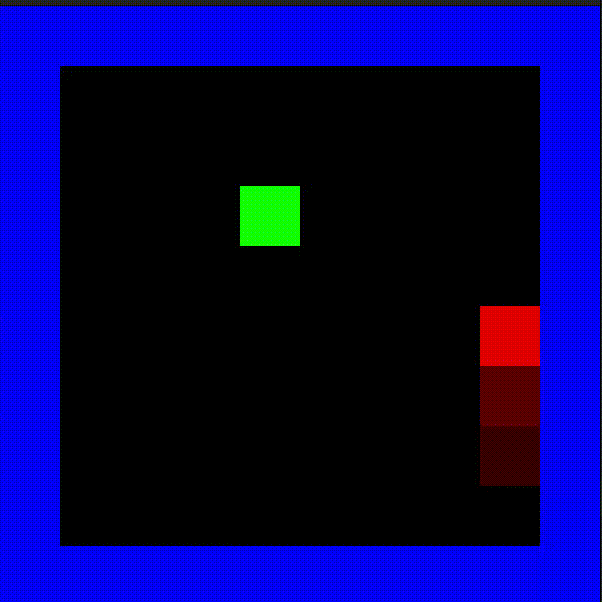

# jungle_gym_cpp
For practicing libtorch and RL/ML in C++

## SnakeEnv

### Environment

#### Observation space:
Fully observable with each position containing $c$ channels, i.e. a tensor
of shape `[x,y,c]` where `x` and `y` correspond to width/height and $c$ is a channel encoding as follows:
- $c_0$ snake body
- $c_1$ snake head
- $c_2$ food
- $c_3$ wall

#### Rewards:

- REWARD_COLLISION = -1
- REWARD_APPLE = 1
- REWARD_MOVE = -0.05

#### Action space:

- UP = 0
- RIGHT = 1
- DOWN = 2
- LEFT = 3

## Notes

### 1. Vanilla Policy Gradient

#### Action sampling
$$
a_t =
\begin{cases}
\text{random action}, & \text{with probability } \epsilon \\
\arg\max_a \pi_\theta(a | s_t), & \text{with probability } 1 - \epsilon
\end{cases}
$$

#### Reward
$$ R_t = r_t + \gamma R_{t+1}$$

#### Loss

$$
L_\tau = -\sum_{t=0}^{T-1} \log p(a_t^*) \cdot R_t
$$

where $a_t^*$ is the action corresponding to the maximum probability in $\pi_\theta(a | s_t)$, or the action sampled
randomly in the case of epsilon greedy policies.

#### Epsilon annealing

$$
\epsilon_t = 0.99^{\frac{cn}{N}}
$$

- $n$ is the current episode index.
- $N$ is the total number episodes. 

The decay terminates when $\epsilon \approx 0.01$ by computing $c = \log_{0.99}(0.01) = 458.211$, for example

### 2. Policy Gradient with entropy regularization

Because the training converges early, entropy regularization might be able to help prevent a feedback loop between 
action sampling (generating the training data) and bias in the policy.

$$
L_{\text{total}} = - \sum_{t=0}^{T-1} \left( \log \pi_\theta(a_t | s_t) \cdot R_t + \lambda H(\pi_\theta(a_t | s_t)) \right)
$$

where $R_t$ is computed according to Temporal Difference recurrence relation:

$$
R_t = r_t + \gamma R_{t+1}
$$

and $H(\mathcal{X})$ is the entropy of the action distribution at time $t$:

$$
H(\mathcal{X}) = - \sum_{x \in \mathcal{X}} p(x) \log p(x)
$$

Entropy is maximized when the action distribution emitted by the policy $\pi_\theta(a_t|s_t)$ is uniform, and minimized 
when any value tends toward 1. Entropy regularization therefore rewards exploration, in perhaps a more nuanced way than 
epsilon greedy sampling.

### 3. Actor-critic Policy Gradient with entropy regularization

WIP

$$
L_{\text{actor}} = - \sum_{t=0}^{T-1} \left( \log \pi_\theta(a_t | s_t) \cdot [R_t - V(s_t)] + \lambda H(\pi_\theta(a_t | s_t)) \right)
$$

$$
L_{\text{critic}} = \frac{1}{2} \sum_{t=0}^{T-1} \left( V(s_t) - \left( R_t + \gamma V(s_{t+1}) \right) \right)^2
$$

## Models

### **ShallowNet**

| **Layer**       | **Dimensions**   |
|-----------------|------------------|
| **input**       | `w*h*4`          |
| **fc**          | 256              |
| **layernorm**   | -                |
| **GELU**        | -                |
| **fc**          | 256              |
| **layernorm**   | -                |
| **GELU**        | -                |
| **fc**          | 256              |
| **layernorm**   | -                |
| **GELU**        | -                |
| **fc**          | `output_size`    |
| **log_softmax** | `output_size`    |

### **SimpleConv**

- Densenet with layer grouping, 3 convolutions (stride 1, kernel of 3)
- CBAM channel/spatial attention

## Results

An example of a mildly successful Policy Gradient agent trained with entropy regularization. You can see that it has 
converged on a circling behavior for self-avoidance, and it biases its circular motion toward the apple, stochastically.

WIP

## To do
- Print critic's value estimation for every state during test demo
- plot attention map 
- implement a3c (now currently a2c)
- Break out epsilon annealing into simple class
- ~~Critic network and baseline subtraction~~
- Visualization:
  - basic training loss plot (split into reward and entropy terms)
  - ~~trained model behavior~~ 
    - save as GIF/video (automatically)
  - action distributions per state
- More appropriate model for encoding observation space
  - ~~CNN (priority)~~
  - RNN
  - GNN <3
- DQN 
  - likely important for SnakeEnv, which is essentially [Cliff World](https://distill.pub/2019/paths-perspective-on-value-learning/)
- ~~Abstract away specific NN classes~~
- Exhaustive comparison of methods

