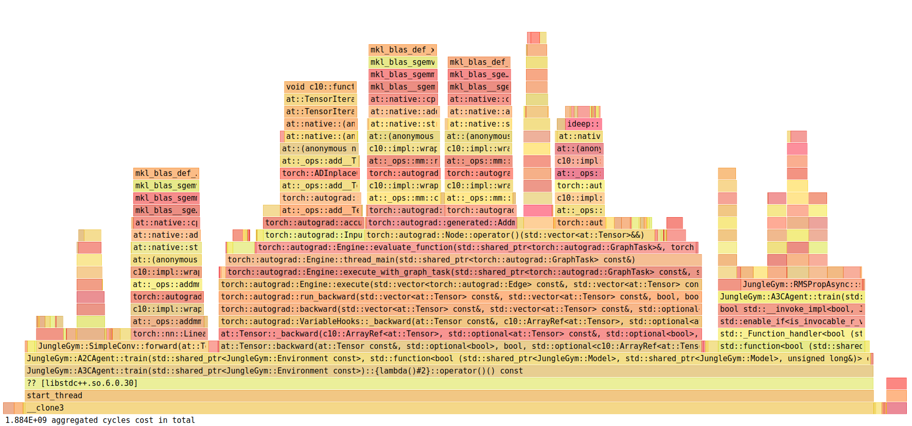
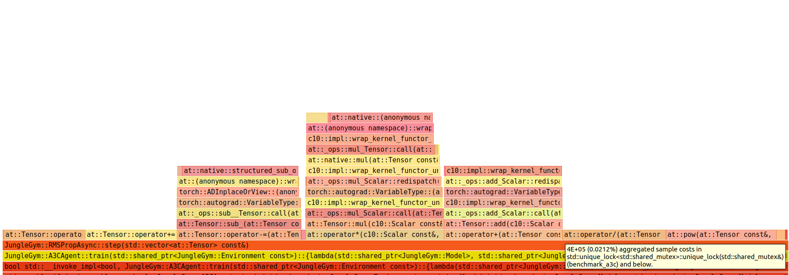
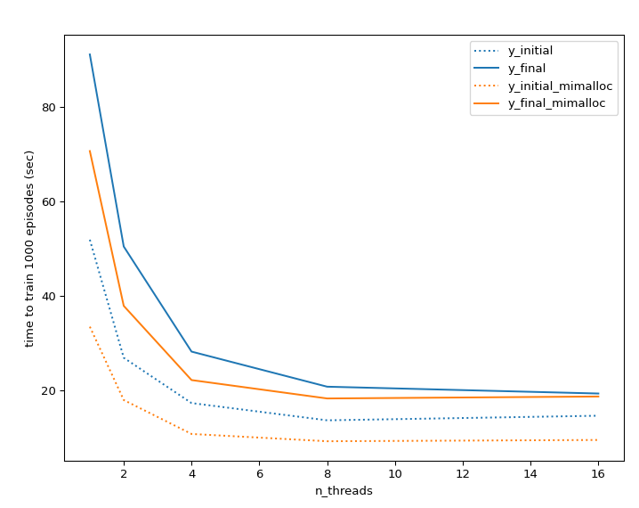

## A3C benchmarking

Benchmarking A3C requires controlling for several factors:
- **number of episodes**: we fix n_episodes at 1000
- **model-related factors**: since the update step occurs after T steps OR upon termination, time until termination by 
the environment depends on the model. To account for this factor, the benchmark is run using both the initial and final 
model, assuming that the trained ("final") model life expectancy is ~T time steps
- **parallel tensor operations**: libtorch's default use of OMP for multithreaded Tensor operations are disabled with
`torch::set_num_threads(1)` to prevent torch threads from being conflated with a3c worker threads

The benchmarking executable loops over n_threads. Steps per episode is 16 (not shown):

```c++
    // --- loop over n_threads ---
    for (auto n: {1,2,4,8,16}) {
        hyperparams.n_threads = n;
        hyperparams.n_episodes = 1000;
        hyperparams.silent = true;

        // --- Initial ---
        // Measure time to train initial model (short episodes, update is bottleneck)
        A3CAgent c(hyperparams, actor, critic);
        c.load(initial_output_dir / "actor.pt", initial_output_dir / "critic.pt");

        auto start_time = std::chrono::high_resolution_clock::now();
        c.train(env);
        auto end_time = std::chrono::high_resolution_clock::now();

        std::chrono::duration<double> elapsed_time = end_time - start_time;
        std::cout << "initial\t" << n << "\t" << elapsed_time.count() << "\n";

        // --- Final ---
        // Measure time to train final model (long episodes, update is less of bottleneck)
        A3CAgent d(hyperparams, actor, critic);
        d.load(final_output_dir / "actor.pt", final_output_dir / "critic.pt");

        start_time = std::chrono::high_resolution_clock::now();
        d.train(env);
        end_time = std::chrono::high_resolution_clock::now();

        elapsed_time = end_time - start_time;
        std::cout << "final  \t" << n << "\t" << elapsed_time.count() << "\n";

    }
```

The results show that there is a negligible benefit beyond 8 threads when using the SnakeEnv:


| n_threads | initial  | final   |
|-----------|----------|---------|
| 1         | 51.8932  | 91.1588 |
| 2         | 26.867   | 50.4489 |
| 4         | 17.265   | 28.1729 |
| 8         | 13.6072  | 20.7357 |
| 16        | 14.5809  | 19.288  |


However, surprisingly, perf reports very low lock contention when profiling the same benchmark at 16 threads
```
sudo perf lock record ./benchmark_a3c
perf lock contention
 contended   total wait     max wait     avg wait         type   caller

     10051    108.29 ms     75.93 us     10.77 us     spinlock   Unknown
      2475     88.99 ms     77.47 us     35.96 us     spinlock   Unknown
      9501     88.67 ms     60.68 us      9.33 us     spinlock   Unknown
        70     73.34 ms      1.78 ms      1.05 ms      rwsem:W   Unknown
        50      2.60 ms     78.34 us     51.91 us     spinlock   Unknown
       109      1.87 ms     37.17 us     17.13 us     spinlock   Unknown
       118      1.57 ms     30.77 us     13.31 us     spinlock   Unknown
        28      1.50 ms     78.92 us     53.59 us     spinlock   Unknown
        27      1.46 ms     78.19 us     53.94 us     spinlock   Unknown
        28      1.39 ms     78.95 us     49.81 us     spinlock   Unknown
        25      1.35 ms     78.31 us     54.17 us     spinlock   Unknown
        62    673.54 us     28.02 us     10.86 us     spinlock   Unknown
        34    455.48 us     28.30 us     13.40 us     spinlock   Unknown
         8    426.82 us     76.86 us     53.35 us     spinlock   Unknown
        29    375.11 us     36.03 us     12.93 us     spinlock   Unknown
         2    234.12 us    121.09 us    117.06 us      rwsem:R   Unknown
         1     52.30 us     52.30 us     52.30 us     spinlock   Unknown
         2     42.57 us     23.08 us     21.28 us     spinlock   Unknown
         5     39.17 us     11.56 us      7.84 us        mutex   Unknown
         1     31.91 us     31.91 us     31.91 us      rwsem:R   Unknown
         1     30.14 us     30.14 us     30.14 us     spinlock   Unknown
         1     14.46 us     14.46 us     14.46 us     spinlock   Unknown
         1      6.77 us      6.77 us      6.77 us     spinlock   Unknown
         1      5.55 us      5.55 us      5.55 us     spinlock   Unknown
         1      5.27 us      5.27 us      5.27 us      rwsem:W   Unknown
         1      4.82 us      4.82 us      4.82 us     spinlock   Unknown
```

We can check the flame graph to see what is the relative proportion of time spent on rollouts vs optimizer:



It appears that in the A3CAgent::train method, the RMSPropAsync::step method accounts for about 15% of the train time.
It is worth noting that in this implementation the workers are responsible for computing the updates themselves, by
calling the member function of the global RMSPropAsync instance. 

Within the step function, the majority of the cost is in computing the update:



Very little time is attributed to the mutex (highlighted), surprisingly. This suggests that some other form of thread 
overhead is likely the bottleneck, such as cache misses or memory bandwidth. 

To test if memory-related overhead may be improved with mimalloc (a custom memory allocator) I added the option to 
compile with it. The result is a notable improvement in speed, but not necessarily an improvement in thread-related 
bottlenecks, since the plateau is reached at around the same time:

| n_threads | initial  | final   |
|-----------|----------|---------|
| 1         | 33.4494  | 70.6786 |
| 2         | 17.9071  | 37.8691 |
| 4         | 10.7172  | 22.1412 |
| 8         | 9.1711   | 18.2394 |
| 16        | 9.44162  | 18.6533 |


This plot summarizes the findings:


